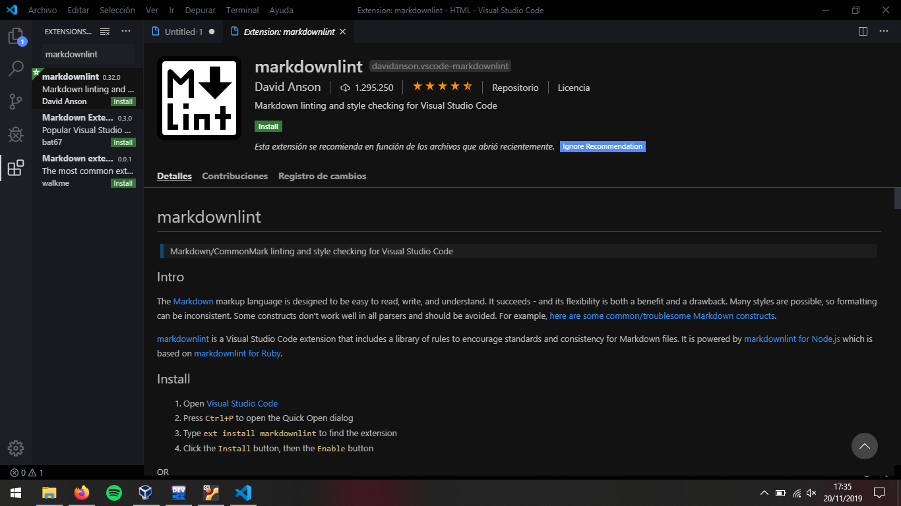
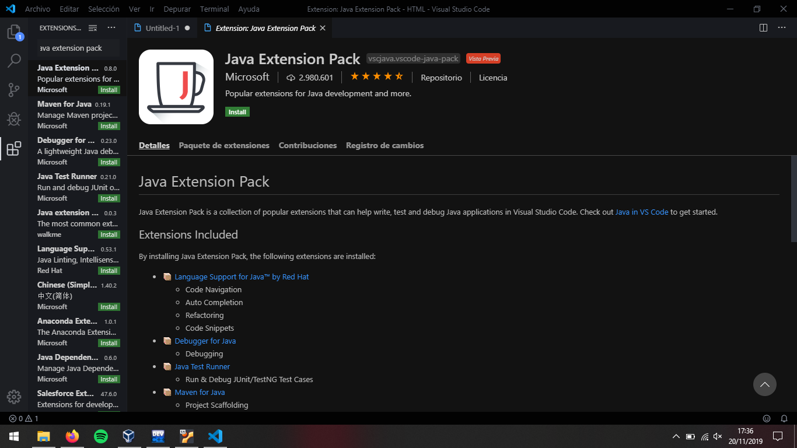
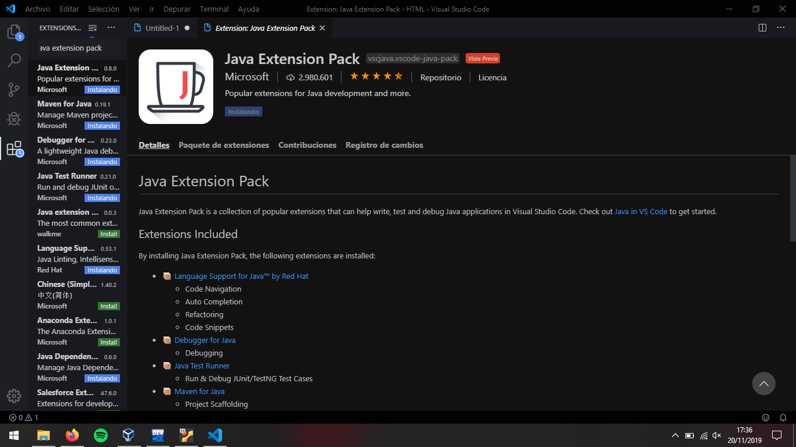
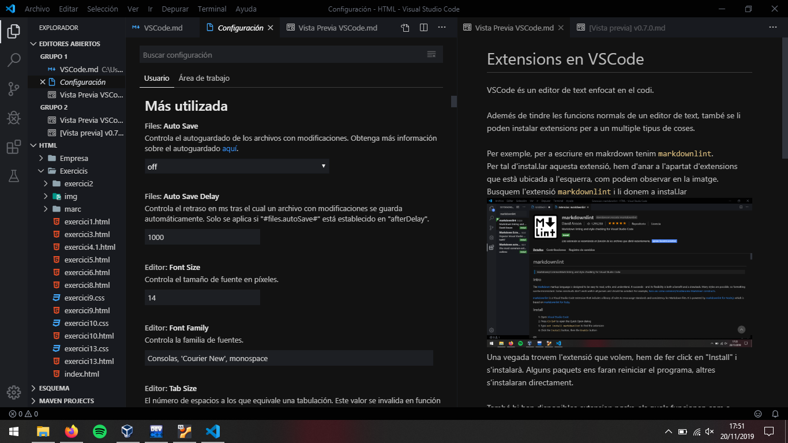
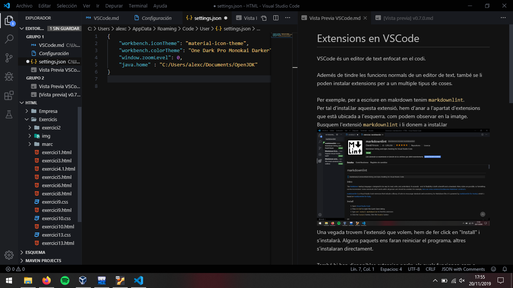

# Extensions en VSCode

VSCode és un editor de text enfocat en el codi. \
\
Ademés de tindre les funcions normals de un editor de text, també se li poden instalar extensions per a un multiple tipus de coses.\
\
Per exemple, per a escriure en makrdown tenim `markdownlint`.\
Per tal d'instal.lar aquesta extensió, hem d'anar a l'apartat d'extensions que està ubicada a l'esquerra, com podem observar en la imatge. Busquem l'extensió `markdownlint` i li donem a instal.lar

Una vegada trovem l'extensió que volem, hem de fer click en "Install" i s'instalarà. Alguns paquets ens faran reiniciar el programa, altres s'instalaran directament.
\
\
També hi han disponibles *extension packs*, els quals funcionen com a paquet que engloba altres paquets. Per a entendre-ho millor, instalarem el `Java Extension Pack` de Microsoft i veurem com al donar-li a instal.lar, instala més d'un paquet a la vegada.

Com podem observar és un paquet normal, però mirem que pasa quan li donem a instal.lar.

Si observem els altres paquets de l'esquerra, estàn començant a instal.lar-se un fum, això és el que fa l'extension pack. (No tots solen ser aixi)\
\
Ara el que volem és afegir el `java.home` a les nostres preferéncies. Per tal de fer aço tenim que fer la combinació de tecles `ctrl + shift + p` i escriure "Preferencias". Una vegada ens apareguen les opcions, seleccionarem la primera. I deu quedar algo aixi:

\
Una vegada aci, busquem `java.home` i fem click a la primera opció que ens aparega. Aci mateix, introduirem la linia que fica `java.home ...`

\
\
I ja estaría tot.

