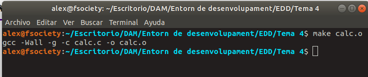
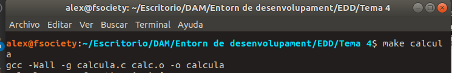
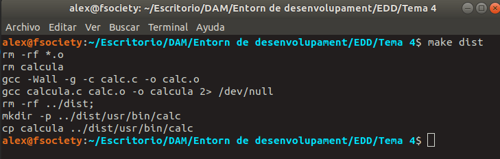
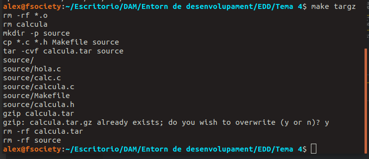
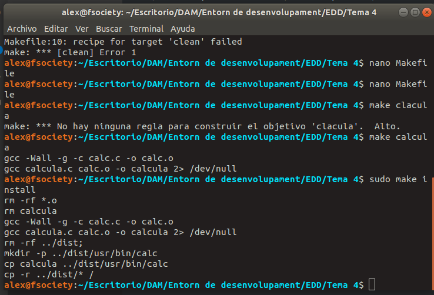

# Pràctiques en make i makefile

## Calculadora

Aci hem de crear els arxius `calc.c` on estaràn les instruccions i `calc.h` que serà l'arxiu header.

```bash
CALCULA.C
int main()
{
        int a=10;
        int b=5;

        printf("La suma de %d i %d és %d\n", a, b, suma(a,b));
        printf("La resta entre %d i %d és %d\n", a, b, resta(a,b));
        printf("La multiplicació de %d i %d és %d\n", a, b, multiplica(a,b));
        printf("La divisió entre %d i %d és %d\n", a, b, divideix(a,b));
        printf("El major numero entre %d i %d és %d\n", a, b, major(a,b));
        printf("La mitja entre %d i %d és %d\n", a, b, mitja(a,b));
}
```

```c
CALC.C

int suma(int op1, int op2){
    return (op1+op2);
}

int resta(int op1, int op2){
    return (op1-op2);
}

int multiplica(int op1, int op2){
    return (op1*op2);
}

int divideix(int op1, int op2){
    return (op1/op2);
}

int major(int op1, int op2){
    int major =  op1>op2 ? op1 : op2;
    return major;

int mitja(int op1, int op2){
    return (op1+op2)/2;
}
```

```c
CALCULA.H

#ifndef MYCALC
#define MYCALC

int suma(int op1, int op2);
int resta(int op1, int op2);
int multiplica(int op1, int op2);
int divideix(int op1, int op2);
int major(int op1, int op2);
int mitja(int op1, int op2);

#endif
```

Una vegada tingam els tres fitxers, tindrem que executar les següents ordres. Primer `gcc -c calc.c -o calc.o` per a que genere l'arxiu `calc.o` sense el main.\
Despres `gcc calc.o calcula.c -o calcula` per a generar l'arxiu `calcula` a partir de l'arxiu `calc.o` i el codi font `calcula.c` que és el que tindrà el main.

## Makefile

Ara hem de crear el makefile.

```
calcula: calcula.c calc.o
    gcc -Wall -g calcula.c calc.o -o calcula

calc.o: calc.c
    gcc -g -Wall -c calc.c -o calc.o
```

Amb aquest makefile el que podem fer es crear calc.o i calcula amb les ordres `make calc.o` i `make calcula` però encara ens falta afegir alguna cosa\
\
Nou makefile:

```
CC=gcc
CFLAGS=-Wall -g

calc.o: calc.c
        $(CC) $(CFLAGS) -c calc.c -o calc.o
calcula: calcula.c calc.o
        $(CC) $(CFLAGS) calcula.c calc.o -o calcula
.PHONY: clean
clean:
        rm -rf *.o
        rm calcula

.PHONY: dist
dist: clean calcula
    rm -rf ../dist;
    mkdir -p ../dist/usr/bin/calc
    cp calcula ../dist/usr/bin/calc

.PHONY: targz
targz: clean
    mkdir -p source
    cp *.c *.h Makefile source
    tar -cvf calcula.tar source
    gzip calcula.tar
    rm -rf calcula.tar
    rm -rf source

install: dist
    cp -r ../dist/* /
```

## Comprovacions

### make calc.o



### make calcula



### make dist



### make targz



### make install

