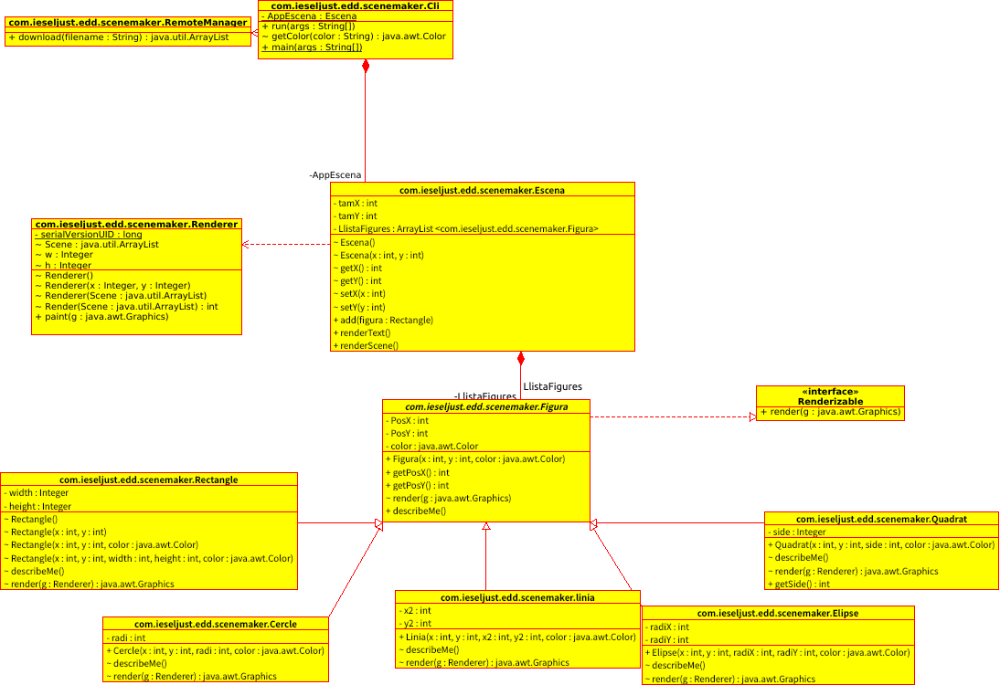

# Diagrama de classes

El diagrama de classes de l'aplicació és el següent.



Com podeu comprovar, el sistema d'inici ja consta de diverses classes i interfícies. A continuació es mostra una breu descripció de les més importants.

## Classe `com.ieseljust.edd.scenemaker.Cli`

Aquesta classe implementa la interfície principal de l'aplicació, contenint el mètode `main` que dóna lloc a la seua arrancada.

Com veieu, presenta l'atribut `AppEscena`, que és la referència a l'escena actual, el mètode `run()` per llançar l'aplicació i un mètode auxiliar `getColor` per traduïr una cadena de text amb un color a un tipus de dada `Color`, representable gràficament (i que no haurem de modificar).

La forma d'implementar la CLI segueix un patró de programació bastant comú, basat en un bucle infinit en el que es demanen ordres, s'analitzen i executen. El bucle s'atura quan s'introdueix l'ordre d'eixir. Simplificant el codi tindríem:

```java
        Scanner keyboard = new Scanner(System.in);

        // Iniciem el bucle infinit fins que escriga "quit".
        String figura;

        do {
            // Preguntem la següent figura a emmagatzemar
            System.out.print("# Figura: ");
            String ordre = keyboard.nextLine();

            // Separem l'ordre introduida pel teclat en la forma:
            // "Figura Posicio Mida Color"
            String[] components = ordre.split(" ");
            figura = components[0];

            switch (figura) {
                case "dimensions":
                    // Execució del cas d'ús "Estableix les dimensions de l'escens"
                    break;
                
                case "rectangle":
                    // Execució del cas d'ús "Afegir Rectangle"
                    break;

                case "get":
                    // Execució del cas d'ús "Descarregar Escena"
                    break;

                case "remotelist":
                    //  Execució del cas d'ús "Llistar Escenes en el servidor"
                    break;

                case "list":
                    // Execució del cas d'ús "Llistar figures en Escena"
                    break;

                case "render":
                    // Execució del cas d'ús "Dibuixar Escena"

                case "quit":
                    // S'ix de l'aplicació

                default:
                    // Si hem arribat aci, l'ordre no es coneix
                    System.out.println("\u001B[31m Figura no reconeguda \u001B[0m");
            }
        } while (true);
```

Per altra banda, com veiem, aquesta classe té una dependència amb la classe `RemoteManager`. Aquesta classe ens ofereix mètodes per tal de poder accedir al servidor i descarregar tant la llista d'escenes, com les escenes en sí. Aquesta classe no haurem de modificar-la per a res.

## Classe `com.ieseljust.edd.scenemaker.Escena`

Representa el conjunt de figures (rectangles) de l'escena. Com veiem, té com a atributs el tamany de l'escena, especificat en píxels, i una llista de rectangles.

En quant a mètodes, aquesta presenta els diferent *mètodes accessors* (*gets* i *sets* per als atributs), un parell de constructors, i el més important: el mètode `add(figura)` per afegir un nou element a aquesta llista, així com els mètodes `renderText()` per mostar pel terminal la llista de figures, i `render`, per generar l'escena.

Per altra banda, aquesta classe té una dependència de la classe `Renderer`, que és la que s'encarregarà de crear la finestra gràfica i *pintar* en ella les diferents figures. En principi, no caldrà modificar res d'aquesta classe.

## Classe `com.ieseljust.edd.scenemaker.Figura`

Aquesta classe és abstracta ja que no anem a instanciar ningún objecte d'aquesta classe sino que la anem a utilitzar per a que les demés figures hereden els atributs i métodes d'aquesta.

Principalment constarà de 3 atributs privats. 2 int que van a ser PosX i PosY que señalaràn la posició de la figura i un color d'objecte Color, que serà el color de la figura.

També tindrà un constructor amb eixos atributs i els seus respectius getters i setters.

La classe constarà també de 2 funcions, una d'ella serà abstracta per a que es tinga que implementar sí o sí i l'altra no serà abstracta però la tindrem que implementar. No és abstracta per a no repetir codi en les distintes classes.

## Classe `com.ieseljust.edd.scenemaker.Rectangle`

Aquesta classe representa els rectangles que dibuixarem a l'escena. Com veiem, és una classe bastant senzilla, amb les propietats de posicionament i dimensions del rectangle, així com el color. Com a mètodes, aporta diferents constructors, els mètodes accessors, i dos mètodes més: `describeMe`, que escriu per consola una descripció del rectangle, i `render(Graphics g)` que dibuixa el rectangle sobre un context gràfic. Com veiem, la nostra classe rectangle, implementa la interfície `Renderizable`, que simplement ens *obliga* a implementar el mètode *render*.

## Classe `com.ieseljust.edd.scenemaker.Quadrat`

Aquesta classe representa els quadrats que dibuixarem a l'escena. Com veiem, és una classe bastant senzilla, amb les propietats del costat del quadrat. Com a mètodes, aporta diferents constructors, els mètodes accessors, i els métodes heredats.

## Classe `com.ieseljust.edd.scenemaker.Ellipse`

Aquesta classe representa els ellipses que dibuixarem a l'escena. Com veiem, és una classe bastant senzilla, amb les propietats del radiX i radiY. Com a mètodes, aporta diferents constructors, els mètodes accessors, i els métodes heredats.

## Classe `com.ieseljust.edd.scenemaker.Cercle`

Aquesta classe representa els cercles que dibuixarem a l'escena. Com veiem, és una classe bastant senzilla, amb les propietats del radi. Com a mètodes, aporta diferents constructors, els mètodes accessors, i els métodes heredats.

## Classe `com.ieseljust.edd.scenemaker.Linia`

Aquesta classe representa les linies que dibuixarem a l'escena. Com veiem, és una classe bastant senzilla, amb les propietats del punt X i Y on aplegarà. Com a mètodes, aporta diferents constructors, els mètodes accessors, i els métodes heredats.